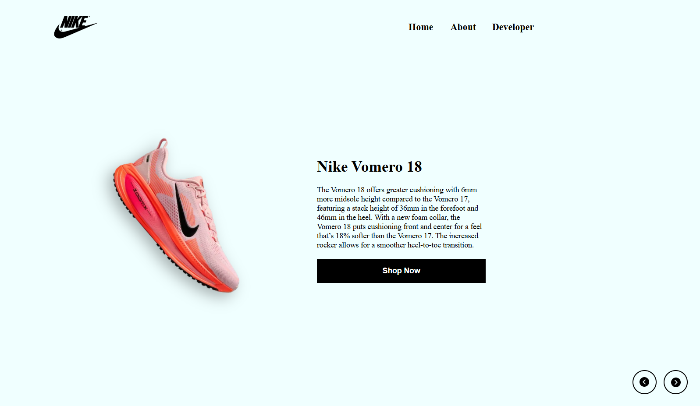

# Nike Landing Page Concept 👟

> A fully responsive, modern landing page built from scratch to study core Front-End development principles.

 
<!-- Note: Take a screenshot of your final website, save it in your images folder, and update the path above -->

## 📖 Project Description

This project is a personal study developed to strengthen my foundational Front-End skills and web design principles. Rather than relying on frameworks, templates, or AI-generated code, I built this landing page entirely from scratch using **pure HTML, CSS, and Vanilla JavaScript**. 

My primary focus for this project was to deeply understand and manually implement modern layout structures.

## ✨ Features

* **Fully Responsive Design:** Adapts flawlessly from desktop monitors to mobile screens using manual CSS media queries, without relying on external grids like Bootstrap.
* **Custom Image Carousel:** A functional slider built with Vanilla JavaScript to seamlessly cycle through different shoe models and update dynamic content (titles, text, and images).
* **Modern CSS Styling:** Utilizes `filter: drop-shadow` for realistic product presentation, clean hover states for interactive elements, and custom typography.
* **Advanced Layout Management:** Practical implementation and combination of **CSS Flexbox** and **CSS Grid** for precise element alignment.

## 🛠️ Technologies Used

* **HTML5:** Semantic structuring and clean markup.
* **CSS3:** Flexbox, Grid, Media Queries, and CSS transitions.
* **JavaScript (ES6+):** DOM manipulation, event listeners, and array/object data handling.

## 🧠 What I Learned

Building this project without frameworks allowed me to understand the "why" behind the code. Key technical takeaways include:
* Managing CSS Specificity and preventing style conflicts across different viewports.
* Understanding how rotation (`transform: rotate`) affects element spacing and bounding boxes, and correcting it for mobile layouts.
* Connecting HTML elements with JavaScript objects to create dynamic, reusable UI components instead of duplicating markup.
* Applying layout techniques that mimic real-world e-commerce designs.

## 🚀 How to Run the Project

1. Clone this repository:
   ```bash
   git clone [https://github.com/your-username/nike-landing-page.git](https://github.com/your-username/nike-landing-page.git)
